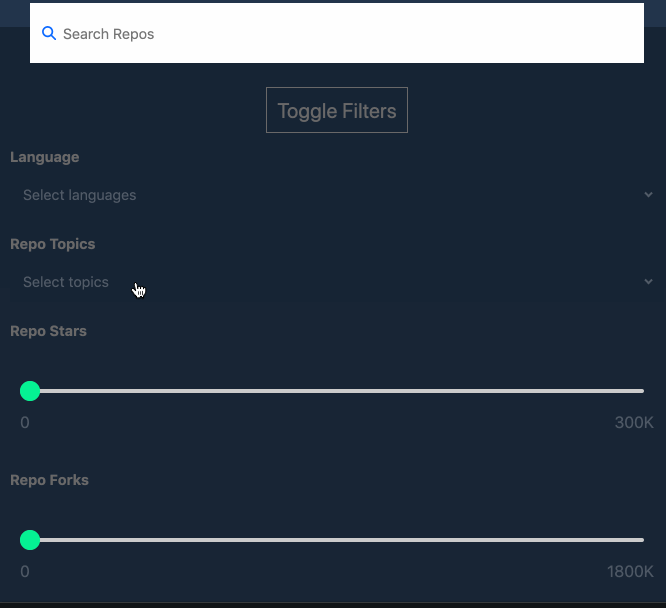

# Elasticsearch-simple-search-UI
Part of a proof of concept. This portion revolves around creating a simple search UI based on indexed data within Elasticsearch. 
This is a work in progress and has yet to be complete.
## Starting up the project
1. Make sure to have the following installed:
    - Node.js installed (should also automatically install npm)
    - Elasticsearch
    - Kibana
    - Vue.js (Through npm -> ```npm install vue```)
    - Elasticsearch.js (Through npm -> ```npm install elasticsearch```)
2. Clone this repo
3. Open ```data.js```  and set ```fileName``` to the file you wish to load to Elasticsearch
4. Repeate step 3 for all files that need to be loaded
5. Open ```index.js``` and set ```indexName``` to the index you want to search on and change the ```searchField``` to desired filed to search on
6. Replace the index field in the following code section with the variable ```indexName``` in place of ```'tx-16```
```
     client.search({index:'tx-16',  body:body, type:'record_list'})
  .then(results => {
    res.send(results.hits.hits);
  })
```
7. Replace the search filed in the following code section with the variable ```searchField``` in place of ```'city'```
```
let body = {
    size: 200,
    from: 0, 
    query: {
      match: {
          'city': req.query['q']
      }
    }
  }
```
8. Navigate to this repo in the terminal and start Node.js server using ```node index.js```
9. Open a web browser and go to http://localhost:3000


## Next steps
To complete this portion of the POC:
1. Give user capabilities to choose which index to search upon (Currently hard coded into ```index.js```)
2. Allow for search to span across multiple indicies
3. Modify design to accomodate filtered searching

### Sample design
